# ai-music-video 전체 시스템 분석 보고서

작성 목적:
- 현재 프로젝트의 전체 로직 흐름을 거시적으로 파악
- 모듈별 책임과 데이터 계약을 코드 기준으로 정리
- 현재 구조적 강점과 실제 문제 지점을 분리해서 진단
- 이후 품질/프롬프트/구조 개선의 기준 문서로 사용

분석 기준:
- 저장소 경로: `/home/jisub-lee/workspace/ai-music-video`
- 분석 범위:
  - CLI / entrypoints
  - orchestration / pipeline / state / artifact publishing
  - audio planning / style resolution / section planning / shot planning / render planning
  - still generation / clip generation / workflow mapping
  - assembly / review / publishability / rerender / escalation / QA analysis
- 검증 근거:
  - 코드 직접 읽기
  - 단위 테스트 구조 확인
  - 최근 live artifact / rerender evidence 확인
  - 최신 전체 테스트 통과: `498 passed in 2.29s`

---

## 1. 한 줄 요약

이 프로젝트는 현재 다음 구조를 가진다.

`concept_text + config`를 입력으로 받아,
1. ACE-Step 기반 음악/가사/타이밍 계획을 만들고,
2. 스타일 lane을 고른 뒤 section/shot/material/render plan을 만들고,
3. Flux2로 still을 생성하고,
4. IA2V(LTX)로 clip을 만들고,
5. ffmpeg 기반 assembly로 final MV를 만들고,
6. publishability review와 rerender loop를 통해 품질 보정/수동 검수 escalation까지 이어지는,
짧은 AI music video 생성 파이프라인이다.

즉 현재 repo는 단순한 이미지/비디오 생성 스크립트가 아니라,
`planning -> generation -> assembly -> review -> rerender -> escalation -> artifact publication`
전체를 가진 제품형 파이프라인이다.

---

## 2. 거시적 흐름 파악

### 2-1. 최상위 실행 흐름

- 콘솔 엔트리포인트: `ai-mv = ai_mv.cli.app:main`
- 사용자 명령은 `cli/app.py -> cli/commands.py -> entrypoints/*`로 라우팅된다.
- 실제 end-to-end 실행은 주로 `entrypoints/start.py -> core/orchestration/pipeline.py` 경로로 진행된다.

주요 실행 단계:
1. CLI 파싱
2. config bootstrap/default 적용
3. WSL/ComfyUI/doctor 체크
4. run state 초기화 및 snapshot 저장
5. stage 순차 실행
   - `audio`
   - `plan`
   - `stills`
   - `clips`
   - `assemble`
   - `review`
6. review 결과가 rerender 필요면 rerender loop 진입
7. rerender가 exhausted면 escalation packet 생성
8. manifest / run_summary / snapshot publish

### 2-2. 메인 stage 순서

실제 pipeline 정의:
- `src/ai_mv/core/orchestration/pipeline.py`

고정 stage 순서:
- `audio -> plan -> stills -> clips -> assemble -> review`

조건부 후속 단계:
- `rerender`
- `escalation`

### 2-3. 현재 canonical generation 정책

현재 validated canon:
- 음악: ACE-Step 기반
- stills: Flux2 (`image_flux2_text_to_image.json`, reference rerender는 `image_flux2.json`)
- clips: IA2V-only (`video_ltx2_3_ia2v.json`)

즉 현재 video routing은 사실상 `ia2v-only`다.
구조상 render_mode abstraction은 존재하지만, 현재 운영 정책은 단일 경로에 가깝다.

---

## 3. 계층별 전체 구조

### 3-1. CLI / Entry / Utility 계층

핵심 파일:
- `src/ai_mv/cli/app.py`
- `src/ai_mv/cli/args.py`
- `src/ai_mv/cli/commands.py`
- `src/ai_mv/entrypoints/start.py`
- `src/ai_mv/entrypoints/preflight.py`
- `src/ai_mv/entrypoints/status.py`
- `src/ai_mv/entrypoints/doctor.py`
- `src/ai_mv/entrypoints/review_packet.py`
- `src/ai_mv/entrypoints/extract_frames.py`
- `src/ai_mv/entrypoints/quality_findings_template.py`

책임:
- 외부 사용자 입력 수집
- subcommand 라우팅
- bootstrap / doctor / status / review utility 진입점 제공

특징:
- `start.py`는 실제 product run 진입점
- `preflight.py`는 audio/plan preview 성격
- 나머지 entrypoint는 QA/ops tool로 분리되어 있음

### 3-2. Orchestration / Runtime 계층

핵심 파일:
- `src/ai_mv/core/orchestration/pipeline.py`
- `src/ai_mv/core/orchestration/stage_runs.py`
- `src/ai_mv/core/orchestration/input_gate.py`
- `src/ai_mv/core/orchestration/bootstrap_guard.py`
- `src/ai_mv/core/orchestration/config_defaults.py`
- `src/ai_mv/core/orchestration/wsl_overrides.py`
- `src/ai_mv/core/orchestration/preflight.py`

책임:
- stage 실행 순서 제어
- stage input validation
- payload merge 보호
- run state/snapshot 저장
- rerender loop / escalation 진입 제어

핵심 특징:
- 각 stage는 `StageInput -> StageOutput` 계약으로 움직임
- payload merge는 canonical key overwrite를 막음
- rerender는 `rerender_*` local key를 쓰고 pipeline이 나중에 canonicalize함

### 3-3. State / Artifact 계층

핵심 파일:
- `src/ai_mv/core/state/state_store.py`
- `src/ai_mv/core/state/state_snapshot.py`
- `src/ai_mv/core/state/state_models.py`
- `src/ai_mv/core/artifacts/publish.py`
- `src/ai_mv/core/artifacts/manifest.py`
- `src/ai_mv/core/artifacts/run_summary.py`
- `src/ai_mv/core/artifacts/summary_fields.py`
- `src/ai_mv/core/artifacts/provenance.py`
- `src/ai_mv/core/artifacts/success_policy.py`

책임:
- run state 관리
- snapshot 저장
- manifest / run_summary / latest / latest_success publish
- escalation summary / review summary 반영

현재 특징:
- 실제 runtime state는 dataclass보다 dict 중심
- artifact publication은 강력하지만 stage artifact list 자체를 전역 보존하는 방식은 약함

### 3-4. Planning 계층

핵심 파일:
- `src/ai_mv/core/planning/sections.py`
- `src/ai_mv/core/planning/creative_direction.py`
- `src/ai_mv/core/planning/shot_plan.py`
- `src/ai_mv/core/planning/shot_intent.py`
- `src/ai_mv/core/planning/routing.py`
- `src/ai_mv/core/planning/render_items.py`
- `src/ai_mv/core/stages/plan_mv.py`

책임:
- audio_map을 section plan으로 normalize
- creative direction 생성
- shot plan 생성
- material plan 생성
- render plan 생성
- workflow-facing prompt contract / edit intent / variation metadata 생성

특징:
- deterministic heuristic planning 비중이 큼
- style lane prompting/rules를 planning의 중심 source of truth로 사용
- richer visual plan schema 모듈은 존재하지만 현재 핵심 runtime 경로는 더 단순한 planning stack을 사용

### 3-5. Style Lane 계층

핵심 파일 패턴:
- `src/ai_mv/styles/<lane>/bible.py`
- `src/ai_mv/styles/<lane>/prompting.py`
- `src/ai_mv/styles/<lane>/rules.py`
- `src/ai_mv/styles/resolver.py`

주요 lane:
- citypop
- synthwave
- alt_pop
- dream_pop
- j_rock
- k_indie

책임:
- style bible 정의
- prompt_seed / prompt_draft 생성
- section shot family 정의
- section variant rotation
- style lane selection

현재 특징:
- citypop이 가장 성숙함
- 나머지 lane은 상대적으로 얇음
- `signals.py / modes.py / materials.py / review.py`는 lane surface는 제공하지만, 실제 planning source of truth는 주로 `bible + prompting + rules`

### 3-6. Engine / Generation 계층

핵심 파일:
- ACE-Step
  - `src/ai_mv/engines/acestep_1_5_aio/planner.py`
  - `src/ai_mv/engines/acestep_1_5_aio/prompting.py`
  - `src/ai_mv/engines/acestep_1_5_aio/mapper.py`
  - `src/ai_mv/engines/acestep_1_5_aio/runner.py`
- Flux2
  - `src/ai_mv/engines/flux2_image/mapper.py`
  - `src/ai_mv/engines/flux2_image/runner.py`
- LTX IA2V
  - `src/ai_mv/engines/ltx_ia2v/mapper.py`
  - `src/ai_mv/engines/ltx_ia2v/runner.py`

책임:
- workflow JSON node mapping
- ComfyUI input staging
- output artifact resolution
- audio timing / duration / file probing

### 3-7. Assembly / Review / QA 계층

핵심 파일:
- assembly
  - `src/ai_mv/core/stages/assemble_mv.py`
  - `src/ai_mv/core/stages/ffmpeg_muxer.py`
- review
  - `src/ai_mv/core/stages/review_stage.py`
  - `src/ai_mv/core/stages/review_outputs.py`
  - `src/ai_mv/core/review/models.py`
  - `src/ai_mv/core/review/publishability.py`
  - `src/ai_mv/core/review/quality_signals.py`
  - `src/ai_mv/core/review/quality_findings.py`
  - `src/ai_mv/core/review/signal_buckets.py`
  - `src/ai_mv/core/review/rerender_policy.py`
- rerender / escalation
  - `src/ai_mv/core/stages/prepare_rerender.py`
  - `src/ai_mv/core/stages/repair_rerender_prompts.py`
  - `src/ai_mv/core/stages/execute_rerender.py`
  - `src/ai_mv/core/stages/rerender_review.py`
  - `src/ai_mv/core/stages/rerender_loop.py`
  - `src/ai_mv/core/stages/rerender_escalation.py`
- analysis tooling
  - `src/ai_mv/analysis/review_packet.py`
  - `src/ai_mv/analysis/frame_extract.py`
  - `src/ai_mv/analysis/contact_sheet.py`

책임:
- clip trim / timing snap / final video mux
- publishability review
- rerender target classification
- prompt repair / rerender execution
- rerender-after review
- manual review escalation packet generation

---

## 4. 모듈별 상세 분석

## 4-1. CLI / Entry 상세

### `cli/app.py`
- argparse parser 생성
- subcommand parse
- dispatch 위임

### `cli/commands.py`
- command name -> entrypoint 함수 매핑
- 실제 실행 분기점

### `entrypoints/start.py`
- single-flight lock
- default_config/bootstrap
- WSL override 적용
- doctor checks 실행
- run dir 선점
- `run_pipeline()` 호출

### `entrypoints/preflight.py`
- full generation 대신 audio + plan preview
- artifact/snapshot도 남김

### `entrypoints/status.py`
- snapshot 요약 출력
- 현재는 얇은 상태 조회 utility

### 분석 포인트
장점:
- user-facing command와 core orchestration이 잘 분리됨

문제:
- 상태/리뷰 utility는 잘 나뉘어 있지만, 실제 product completion 판단은 status command보다 artifact reading이 더 정확함

---

## 4-2. Orchestration 상세

### `pipeline.py`
책임:
- stage order 정의
- `run_result_stage()` 반복 호출
- review 후 rerender 여부 판단
- rerender 결과 canonicalization
- escalation 진입
- final artifact publish

강점:
- 구조가 명확함
- rerender loop를 top-level pipeline에 안전하게 끼워 넣음

문제:
- `state.status=done`와 실제 publishability는 다를 수 있음
- 즉 pipeline completion과 product readiness가 분리돼 있음

### `stage_runs.py`
책임:
- stage 실행 wrapper
- snapshot 저장
- error/failure_reason 기록
- payload merge 보호

강점:
- stage failure handling이 비교적 명확함
- protected payload key overwrite 차단이 구조 안정성에 도움

문제:
- `StageOutput.artifacts`가 전역 state/manifest에 자동 보존되지는 않음

### `input_gate.py`
책임:
- 각 stage의 upstream key/row linkage 검사

강점:
- prototype 수준보다 훨씬 엄격한 계약 검사
- payload 구조 drift를 초기에 차단함

문제:
- 현재는 strong validation 중심이라, 외부/legacy payload 호환성은 낮아질 수 있음

### `scheduler.py`
문제:
- 현재 `stage_registry` import가 깨져 있음
- main runtime은 `pipeline.py`를 직접 써서 돌아가지만, scheduler module은 dead/broken code 상태

이건 현재 구조상 명시적 결함 중 하나다.

---

## 4-3. Audio planning / ACE-Step 상세

### `acestep_music.py`
역할:
- stage wrapper
- planner 호출
- runner 호출
- audio_map/music_file 반환

### `engines/acestep_1_5_aio/planner.py`
역할:
- LLM 기반 song outline / lyric block 계획
- section 구조, bpm, language, tags, lyrical blocks를 강하게 계약화

강점:
- 현재 repo에서 가장 성숙한 planning 컴포넌트 중 하나
- retry/normalize/validation 흐름이 있음
- lyric block contract가 비교적 명확함

문제:
- audio planning은 강력하지만 여전히 LLM draft reliability에 의존
- 일부 header omission 류 edge case는 과거에도 실제 smoke run에서 문제를 일으킨 적 있음

### `engines/acestep_1_5_aio/runner.py`
역할:
- ComfyUI workflow 실행
- output audio 수집
- ffprobe duration
- beat/bar timing 분석
- song timing/sections 구축

강점:
- downstream assembly가 실제 timing map을 활용할 수 있게 연결됨

---

## 4-4. Planning / Style / Prompting 상세

### `styles/resolver.py`
역할:
- style lane selection
- style pack registry

강점:
- style resolution 자체는 단순하고 해석 가능함

문제:
- lexical matching 기반이라 brittle함
- bible overlap에 취약
- signals/modes metadata를 실제 resolution에 거의 활용하지 않음

### `sections.py`
역할:
- audio_map sections normalization
- canonical section type 변환
- M1 short-form compression

강점:
- short-form MV에 맞는 section normalization 로직이 잘 들어가 있음

문제:
- heuristic이 강해, concept-specific section dramaturgy를 더 깊게 반영하진 못함

### `creative_direction.py`
역할:
- concept/style 기반 high-level MV direction heuristic 생성

문제:
- semantic richness는 제한적
- heuristic summary 레벨에 머무름

### `shot_plan.py`
역할:
- section -> shot specs expansion
- section variant 적용
- shot_intent 붙이기
- shot numbering / render_mode routing

강점:
- planning core의 중심
- section/shot/material/render 분해 구조가 명확함

문제:
- render_mode abstraction은 있으나 현재 사실상 mono-strategy (`ia2v`)임

### `render_items.py`
역할:
- prompt contract 중심 모듈
- shared legacy fields + workflow-specific fields 생성
- variation profile 생성
- edit_intent / render_planning 생성

강점:
- 현재 pipeline에서 가장 중요한 허브 중 하나
- `still_prompt_text`, `clip_prompt_seed`, `clip_positive_prompt` 분리가 존재
- variation/edit_intent/review metadata까지 이어짐

문제:
- shared variation profile이 still/clip을 동시에 끌고 가는 구조라, scenic bias가 상위에서 같이 번질 수 있음
- 최근에 clip contamination leak 일부는 줄였지만, 아직 완전 절연은 아님

### Style lane maturity
- citypop: 매우 성숙
- synthwave: 비교적 안정
- alt_pop/dream_pop/j_rock/k_indie: 기능은 갖췄지만 얇고 불균일

이는 runtime quality 편차의 원인이 될 수 있다.

---

## 4-5. Still generation 상세

### `render_stills.py`
역할:
- render_plan 기반 still generation
- candidate_images 생성
- still constraint policy 적용
- prior still reference reuse 지원

강점:
- still constraint layer가 따로 있어 panel/collage류 문제를 억제함
- render_count 기반 candidate generation도 지원

문제:
- candidate를 여러 개 만들지만 자동 선택은 그냥 첫 번째다
- 즉 generation quality ranking loop가 없음
- still constraint policy가 style-authored prompt를 간접적으로 변형시키므로, style prompt와 실제 sent prompt 사이에 차이가 생김

### `flux2_image/mapper.py`, `runner.py`
역할:
- text-to-image / reference-image workflow mapping
- Comfy execution
- output recovery/fallback

강점:
- reference rerender 경로가 분리돼 있어 still refinement에 유리

문제:
- latest still reanchor fix는 fresh planning 기반 live revalidation이 아직 더 필요함

---

## 4-6. Clip generation 상세

### `render_clips.py`
역할:
- still_results + music_file + render_plan 기반 IA2V clip generation

강점:
- 현재 canon에 맞게 `ia2v-only`를 명확히 강제함
- source still/music file 누락 시 fail-fast

최근 개선:
- clip fallback에서 `prompt_polish` / `prompt_draft` 오염을 줄였음
- intro/bridge/outro 구간은 shared variation이 environment-heavy여도 clip camera를 neutral하게 중화함

문제:
- clip prompt는 아직 overall generic-safe 경향이 남음
- 즉 contamination은 줄었지만 shot별 공격성/차별화는 아직 추가 개선 여지 큼

### `ltx_ia2v/mapper.py`
역할:
- IA2V workflow node mapping

문제/주의:
- `prompt_seed`가 numeric RNG라기보다 workflow 내부 string slot에 들어가는 구조라,
  stochastic control semantics는 workflow internals에 더 의존함

---

## 4-7. Assembly 상세

### `assemble_mv.py`
역할:
- clip file resolution
- trim window 계산
- beat/bar timing snap
- assembly_plan 생성
- review_inputs enrichment

강점:
- 단순 concat이 아니라 edit_intent, cadence, snap, timing map이 실제 review metadata로 이어짐
- trim/snap reasoning이 현재 구조의 큰 강점 중 하나

문제:
- assembly revision action은 존재하지만, 일부는 metadata-level revision 비중이 커서 “실제 final_video 재조립”까지 항상 직결되지는 않음

### `ffmpeg_muxer.py`
역할:
- concat demuxer 기반 mux
- inpoint/outpoint 지원
- scale + h264/aac encode
- `-shortest`로 audio/video 길이 맞춤

문제:
- final video와 audio duration 차이가 아주 소량 남을 수 있음
- 즉 기술적으로는 정상이어도 마지막 polish 관점 리스크는 남음

---

## 4-8. Review / Publishability 상세

### `review_stage.py`
역할:
- quality findings merge
- coverage/drift/asset existence 집계
- rerender target 계산
- review_report 생성

### `review/models.py`
역할:
- shot quality summary
- assembly quality summary
- rerender plan/payload/execution payload
- benchmark dimensions / signal buckets 포함한 full review report build

### `publishability.py`
역할:
- failure bucket 분류
- rerender target action 분류
- rerender prescription 생성

강점:
- 단순 “파일 존재 확인” 이상의 구조화된 publishability review
- final MV publishability를 독립 bucket으로 다룸
- manual findings를 구조적으로 받아 rerender target/action으로 연결함

문제:
- action vocabulary는 풍부하지만, 모든 action이 fully executable하진 않음
- 일부 `fix_strategy`는 review report에 존재해도 prompt repair가 아직 직접 구현 안 되어 no-op일 수 있음

즉 review system은 diagnosis 면에서는 강하지만,
execution coverage는 아직 diagnosis breadth를 완전히 따라가지 못한다.

---

## 4-9. Rerender / Escalation 상세

### `prepare_rerender.py`
역할:
- review_report.rerender_execution_payloads -> stage별 payload로 재구성

### `repair_rerender_prompts.py`
역할:
- fix_strategy + prompt_contract_focus 기반 prompt mutation

### `execute_rerender.py`
역할:
- still/clip rerender 실행
- review pseudo-stage action 처리
- sync repair / assembly revision path 처리

### `rerender_review.py`
역할:
- rerendered assets merge
- stale manual findings 제거
- review_stage 재실행
- assembly revision improvement 계산

### `rerender_loop.py`
역할:
- 위 단계를 한 번의 nested corrective loop로 연결

### `rerender_escalation.py`
역할:
- rerender exhausted 시 manual review packet handoff 생성

강점:
- 이 repo의 핵심 경쟁력 중 하나
- rerender loop가 단순 재시도 수준을 넘어서,
  prompt repair / provenance / stale finding filtering / escalation까지 구조화돼 있음

문제:
- escalation/review packet이 실제 frame extraction이나 contact sheet PNG까지 자동 생성하지는 않음
- 일부 recommended action은 여전히 report-rich / execution-thin 상태

---

## 4-10. QA / Analysis tooling 상세

### `analysis/review_packet.py`
역할:
- review-packet.json
- review-findings.json
- review-notes.md
- contact-sheet.json
생성

문제:
- frame extraction 계획은 세우지만, packet 생성 자체가 frame extract를 실행하지는 않음
- contact-sheet.png도 manifest target만 있고 자동 렌더는 아님

### `analysis/frame_extract.py`
역할:
- ffmpeg 기반 frame extraction
- clip: first/middle/last
- final: evenly spaced sample

### `entrypoints/quality_findings_template.py`
역할:
- manual findings scaffold 생성

이 계층은 리뷰/수동검수 운영성에 매우 중요하지만,
아직 “완전 자동 QA 패키지” 수준까지는 안 닫혔다.

---

## 5. 코드 기반 검증

이번 분석에서 확인한 직접 근거:

### 5-1. 테스트 상태
- 최신 full suite:
  - `498 passed in 2.29s`

의미:
- 현재 구조/계약 변경에도 기본 regression surface는 꽤 안정적임

### 5-2. live rerender 검증
최근 live rerender 검증 결과:
- run id: `mv-smoke-live-citypop-payoff-rerender-contract-r3`
- before:
  - `needs_rerender`
  - `final_mv_quality: 83.0`
- after:
  - `done`
  - `publish`
  - `final_mv_quality: 95.0`

의미:
- rerender loop가 실제로 end-to-end corrective path로 동작함
- clip contamination reduction은 실제 ComfyUI prompt history에서도 확인됨

### 5-3. artifact 검증으로 확인된 사실
- real still/clip artifacts 생성 완료
- review->rerender->after-review publish 복구 구조가 실제 artifact로 검증됨

### 5-4. 코드 레벨 명시 결함
현재 코드 기준 명시적 문제:
1. `scheduler.py`의 broken import (`stage_registry` 없음)
2. review packet/contact sheet 자동 생성 completeness 부족
3. 일부 review action / fix_strategy는 diagnosis 대비 execution coverage 부족
4. style metadata system이 이중화되어 drift 위험 존재
5. non-citypop lane maturity 편차 큼
6. still candidate selection ranking loop 부재
7. latest citypop still reanchor fix는 fresh plan 기반 live 재검증이 아직 더 필요

---

## 6. 현재 프로젝트의 문제를 어디서 봐야 하는가

현재 문제는 크게 4가지 층에서 봐야 한다.

### 문제층 A. 구조/아키텍처 문제
상태:
- 대부분 닫힘
- 명시적 결함은 `scheduler.py` 정도

판정:
- 구조가 main bottleneck는 아님

### 문제층 B. 플래닝/계약 오염 문제
상태:
- workflow-specific prompt split은 존재
- 하지만 shared variation/controller의 얇은 coupling이 남음
- clip contamination leak는 최근 완화됨

판정:
- 현재 핵심 제품 리스크 중 하나

### 문제층 C. lane quality 편차 문제
상태:
- citypop 중심 최적화가 가장 앞서 있음
- 다른 lane은 상대적으로 얇음

판정:
- 범용 제품화 관점에서 중요 리스크

### 문제층 D. review/execution 비대칭 문제
상태:
- review는 풍부하게 진단
- execution은 일부 action에서 아직 manual fallback이 많음

판정:
- 운영/품질 안정화의 핵심 잔여 리스크

---

## 7. 현재 완성도를 어떻게 봐야 하나

보수적 판정:
- 구조/아키텍처: 100%
- 제품 완성도: 96~97%

왜 100%가 아닌가?
- 프롬프트/결과 품질 튜닝이 아직 주된 잔여 작업
- 일부 lane의 maturity 불균형
- review packet 자동화 completeness 미완성
- latest still-side prompt fix의 fresh live validation 추가 필요

즉 지금은 “구조를 더 새로 짜야 하는 단계”가 아니라,
“품질/계약/운영 안정화 단계”가 맞다.

---

## 8. 다음 액션 우선순위

### 우선순위 1
fresh planning 기반 live validation 재실행
- 목적:
  - latest still reanchor fix 실제 반영 확인
  - latest clip contamination reduction과 함께 fresh artifact 기준 검증

### 우선순위 2
clip prompt contract role-specific 강화
- contamination은 줄였지만 여전히 generic-safe 경향 존재
- 특히 intro/bridge/outro/verse support 계열 차별화 강화 필요

### 우선순위 3
review packet automation completeness 보강
- frame extraction + contact sheet image 생성까지 더 닫기

### 우선순위 4
style lane maturity 정렬
- citypop 외 lane의 prompting/rules thickness 보강

### 우선순위 5
dead/broken surface 청소
- `scheduler.py` broken import 정리
- visual_plan richer contract와 active runtime contract 간 진실원천 정리

---

## 9. 전체 플로우차트 (Mermaid)

아래 플로우차트는 현재 repo의 전체 로직을 가능한 빠짐없이 단계별로 연결한 것이다.

```mermaid
flowchart TD
    A0[User / CLI ai-mv] --> A1[cli/app.py main]
    A1 --> A2[cli/args.py parser]
    A2 --> A3[cli/commands.py dispatch]

    A3 -->|start| B0[entrypoints/start.py]
    A3 -->|preflight| B1[entrypoints/preflight.py]
    A3 -->|status| B2[entrypoints/status.py]
    A3 -->|doctor| B3[entrypoints/doctor.py]
    A3 -->|review-packet| B4[entrypoints/review_packet.py]
    A3 -->|extract-frames| B5[entrypoints/extract_frames.py]
    A3 -->|quality-findings-template| B6[entrypoints/quality_findings_template.py]

    subgraph Bootstrap_and_Runtime
      B0 --> C0[config_defaults.py default_config/apply_defaults]
      B1 --> C0
      C0 --> C1[wsl_overrides.py apply_wsl_runtime_overrides]
      C1 --> C2[bootstrap_guard.py input defaults / size / template validation]
      C2 --> C3[doctor checks]
      C3 --> C4[state_store.py ensure_run_dir/init_run_state]
      C4 --> C5[pipeline.py run_pipeline or orchestration/preflight.py run_preflight]
    end

    subgraph Main_Pipeline
      C5 --> D0[stage_runs.py run_result_stage]
      D0 --> D1[audio stage]
      D1 --> D2[plan stage]
      D2 --> D3[stills stage]
      D3 --> D4[clips stage]
      D4 --> D5[assemble stage]
      D5 --> D6[review stage]
    end

    subgraph Audio_Stage
      D1 --> E0[stages/acestep_music.py]
      E0 --> E1[engines/acestep_1_5_aio/planner.py]
      E1 --> E2[engines/acestep_1_5_aio/prompting.py]
      E1 --> E3[engines/acestep_1_5_aio/lyric_blocks.py]
      E0 --> E4[engines/acestep_1_5_aio/mapper.py]
      E0 --> E5[engines/acestep_1_5_aio/runner.py]
      E5 --> E6[utils/audio_timing.py]
      E5 --> E7[audio_plan + audio_map + music_file]
    end

    subgraph Plan_Stage
      D2 --> F0[stages/plan_mv.py]
      F0 --> F1[styles/resolver.py resolve_style_selection]
      F1 --> F2[styles/*/bible.py]
      F1 --> F3[styles/*/prompting.py]
      F1 --> F4[styles/*/rules.py]
      F0 --> F5[planning/sections.py normalized_sections]
      F0 --> F6[planning/creative_direction.py]
      F0 --> F7[planning/shot_plan.py build_shot_plan]
      F7 --> F8[planning/shot_intent.py]
      F7 --> F9[planning/routing.py apply_render_routing]
      F0 --> F10[material_plan builder]
      F0 --> F11[planning/render_items.py build_render_item]
      F11 --> F12[prompt_seed / prompt_draft / prompt_polish]
      F11 --> F13[still_prompt_text]
      F11 --> F14[clip_prompt_seed / clip_positive_prompt]
      F11 --> F15[variation_profile / render_planning / edit_intent]
      F0 --> F16[section_plan + shot_plan + material_plan + render_plan]
    end

    subgraph Still_Generation
      D3 --> G0[stages/render_stills.py]
      G0 --> G1[_still_prompt_text]
      G0 --> G2[_apply_still_constraint_policy]
      G2 --> G3[_single_keyframe_prompt_text / raw mode]
      G0 --> G4[engines/flux2_image/runner.py]
      G4 --> G5[engines/flux2_image/mapper.py]
      G4 --> G6[infra/comfy_client.py + workflow_patcher.py]
      G0 --> G7[still_results]
    end

    subgraph Clip_Generation
      D4 --> H0[stages/render_clips.py]
      H0 --> H1[_clip_prompt_text]
      H0 --> H2[build_clip_positive_prompt result consumption]
      H0 --> H3[engines/ltx_ia2v/runner.py]
      H3 --> H4[engines/ltx_ia2v/mapper.py]
      H3 --> H5[infra/comfy_client.py + workflow_patcher.py]
      H0 --> H6[clip_results]
    end

    subgraph Assembly
      D5 --> I0[stages/assemble_mv.py]
      I0 --> I1[clip path resolution]
      I0 --> I2[trim window calculation]
      I0 --> I3[beat/bar snap from audio_map timing]
      I0 --> I4[assembly_plan]
      I0 --> I5[review_inputs enrichment]
      I0 --> I6[stages/ffmpeg_muxer.py]
      I6 --> I7[final_video]
    end

    subgraph Review
      D6 --> J0[stages/review_stage.py]
      J0 --> J1[quality_findings merge]
      J0 --> J2[review/models.py build_review_report]
      J2 --> J3[review/quality_signals.py]
      J2 --> J4[review/publishability.py]
      J2 --> J5[review/signal_buckets.py]
      J2 --> J6[review/benchmark_dimensions.py]
      J2 --> J7[assembly_quality_summary]
      J2 --> J8[rerender_plan / rerender_payload / rerender_execution_payloads]
      J0 --> J9[review_report]
    end

    J9 --> K0{needs_rerender?}
    K0 -->|no| L0[publish artifacts]
    K0 -->|yes| M0[stages/rerender_loop.py]

    subgraph Rerender_Loop
      M0 --> M1[prepare_rerender.py]
      M1 --> M2[repair_rerender_prompts.py]
      M2 --> M3[execute_rerender.py]
      M3 --> M4[rerender_review.py]
      M4 --> M5[rerender_review_report]
      M5 --> M6[rerender_outcome]
    end

    subgraph Execute_Rerender_Details
      M3 --> N0[rerender stills -> render_stills]
      M3 --> N1[rerender clips -> render_clips]
      M3 --> N2[review action -> repair_audio_video_sync.py]
      M3 --> N3[review action -> apply_assembly_revision in assemble_mv.py]
    end

    M6 --> O0{resolved?}
    O0 -->|yes| L0
    O0 -->|no/exhausted| P0[rerender_escalation.py]

    subgraph Escalation_and_QA
      P0 --> P1[analysis/review_packet.py]
      P0 --> P2[analysis/frame_extract.py]
      P0 --> P3[entrypoints/quality_findings_template.py]
      P0 --> P4[review packet + findings template + reviewer notes + contact-sheet manifest]
    end

    subgraph Artifact_Publication
      L0 --> Q0[state_snapshot.py save_snapshot]
      L0 --> Q1[artifacts/manifest.py]
      L0 --> Q2[artifacts/run_summary.py]
      L0 --> Q3[artifacts/publish.py write_pipeline_artifacts]
      Q3 --> Q4[artifacts/runs/<run_id>/manifest.json]
      Q3 --> Q5[artifacts/runs/<run_id>/run_summary.json]
      Q3 --> Q6[artifacts/runs/<run_id>/snapshot.json]
      Q3 --> Q7[artifacts/latest and latest_success aliases]
    end
```

---

## 10. 결론

현재 프로젝트는 이미 “부분 기능들의 모음” 단계를 넘었다.
지금 상태는 다음과 같이 정리할 수 있다.

- 구조적으로는 거의 완성형 pipeline이다.
- 가장 강한 부분은 orchestration/stage contract, audio planning, citypop lane, assembly-aware review, rerender loop다.
- 가장 약한 부분은 style lane maturity 편차, 일부 review->execution 비대칭, candidate selection 부재, QA packet 자동화 completeness 부족이다.
- 현재 남은 핵심은 더 이상 큰 구조 공사가 아니라,
  - 프롬프트 계약 정교화
  - lane quality 평준화
  - rerender execution coverage 확대
  - QA/analysis 자동화 완성도 보강
이다.

즉 이 프로젝트는 현재
`구조 마감 + 품질/운영 안정화 단계`
라고 보는 것이 가장 정확하다.
