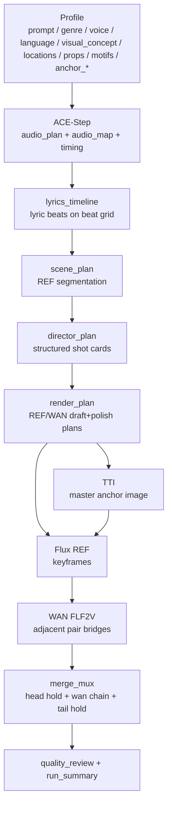

# AI MV Pipeline Overview

이 문서는 현재 active runtime 기준 파이프라인을 한눈에 보려는 운영 문서다.

핵심 철학:
- 음악과 프로필이 주체다.
- 가사는 보조 의미층이다.
- 코드는 구조와 검증만 담당한다.
- 표현 품질은 LLM draft/polish가 담당한다.
- workflow fidelity가 최우선이다.

## 전체 흐름



## 단계별 책임

### 1. ACE-Step
- 파일:
  - [acestep_music.py](/D:/workspace/ai-music-video/src/ai_mv/core/stages/acestep_music.py)
  - [planner.py](/D:/workspace/ai-music-video/src/ai_mv/engines/acestep_1_5_aio/planner.py)
  - [runner.py](/D:/workspace/ai-music-video/src/ai_mv/engines/acestep_1_5_aio/runner.py)
  - [policy.py](/D:/workspace/ai-music-video/src/ai_mv/engines/acestep_1_5_aio/policy.py)
- 역할:
  - 노래의 감정 spine, songform, tags, lyrics
  - 생성된 오디오에서 실제 `beat_times_sec` 추출
  - `audio_map.timing` 생성
- 핵심 출력:
  - `audio_plan`
  - `audio_map.sections`
  - `audio_map.timing.detected_bpm`
  - `audio_map.timing.beat_times_sec`
  - `audio_map.timing.grid_beat_times_sec`
  - `audio_map.timing.bar_times_sec`

### 2. lyrics_timeline
- 파일:
  - [lyrics_timeline.py](/D:/workspace/ai-music-video/src/ai_mv/core/stages/lyrics_timeline.py)
  - [planner.py](/D:/workspace/ai-music-video/src/ai_mv/engines/lyrics_timeline/planner.py)
- 역할:
  - lyric beats를 실제 beat grid 위에 배치
  - 장면 의미의 최소 단위 생성
- LLM 입력:
  - lyric lines
  - visual_concept
  - locations
  - props
  - motifs
  - language
- 출력:
  - `lyric_beats[*].line_refs`
  - `literal_image`
  - `visible_action`
  - `emotional_turn`
  - `continuity_anchor`
  - `payoff_role`
  - `start_beat_index/end_beat_index`
  - `start_sec/end_sec`

### 3. scene_plan
- 파일:
  - [scene_plan.py](/D:/workspace/ai-music-video/src/ai_mv/core/stages/scene_plan.py)
  - [planner.py](/D:/workspace/ai-music-video/src/ai_mv/engines/scene_plan/planner.py)
- 역할:
  - 기본 원칙은 `1 lyric beat = 1 REF`
  - 예외적으로만 split
    - `duration_sec > wan_max_clip_sec`
    - release/payoff가 충분히 길고 큰 전환일 때
- 출력:
  - `scene_outline.shot_packages[*]`
  - `segment_focus`
  - `anchor_sec = start_sec`

### 4. director_plan
- 파일:
  - [director_plan.py](/D:/workspace/ai-music-video/src/ai_mv/core/stages/director_plan.py)
  - [planner.py](/D:/workspace/ai-music-video/src/ai_mv/engines/director_plan/planner.py)
- 역할:
  - structured shot card 생성
  - `place/action/carry/framing` 결정
- 규칙:
  - `locations`를 우선 사용
  - heuristic place inference는 fallback만
  - 코드가 스타일 문구를 만들지 않음

### 5. render_plan
- 파일:
  - [render_plan.py](/D:/workspace/ai-music-video/src/ai_mv/core/stages/render_plan.py)
  - [planner.py](/D:/workspace/ai-music-video/src/ai_mv/engines/render_plan/planner.py)
  - [render_verbalizer.py](/D:/workspace/ai-music-video/src/ai_mv/core/stages/render_verbalizer.py)
- 역할:
  - REF/WAN용 최소 structured context 생성
  - `seed -> LLM full draft -> LLM polish`
- 금지:
  - 코드 subject wording 강제
  - 코드 스타일 정규화
  - 코드 문장 미학 보정

### 6. TTI
- 파일:
  - [tti_anchor.py](/D:/workspace/ai-music-video/src/ai_mv/core/stages/tti_anchor.py)
- 역할:
  - 캐릭터 anchor 이미지 생성
- 프로필 소비:
  - `anchor_subject`
  - `anchor_hair`
  - `anchor_top`
  - `anchor_bottom`
  - `anchor_shoes`
  - `anchor_pose`
  - `anchor_background`
- 주의:
  - 국적/스타일/직업은 프로필에 직접 넣어야 한다
  - 코드가 언어로 자동 추론하지 않는다

### 7. Flux REF
- 파일:
  - [flux2_ref_chain.py](/D:/workspace/ai-music-video/src/ai_mv/core/stages/flux2_ref_chain.py)
  - [runner.py](/D:/workspace/ai-music-video/src/ai_mv/engines/flux_2_dev_ref/runner.py)
  - [mapper.py](/D:/workspace/ai-music-video/src/ai_mv/engines/flux_2_dev_ref/mapper.py)
- 역할:
  - TTI master anchor + REF prompt로 keyframe 생성
- 현재 범위:
  - workflow graph 재설계는 아직 하지 않음
  - timing/prompt contract만 우선 정리

### 8. WAN
- 파일:
  - [wan_interpolation.py](/D:/workspace/ai-music-video/src/ai_mv/core/stages/wan_interpolation.py)
  - [runner.py](/D:/workspace/ai-music-video/src/ai_mv/engines/wan_2_2_flf2v/runner.py)
  - [mapper.py](/D:/workspace/ai-music-video/src/ai_mv/engines/wan_2_2_flf2v/mapper.py)
- 역할:
  - 인접 REF pair의 motion bridge 생성
- 규칙:
  - `frames = round(duration_sec * wan_fps)`
  - hard cap 없음
  - clip 길이 통제는 upstream segmentation 책임

### 9. merge + review
- 파일:
  - [merge_mux.py](/D:/workspace/ai-music-video/src/ai_mv/core/stages/merge_mux.py)
  - [media_resolver.py](/D:/workspace/ai-music-video/src/ai_mv/core/stages/media_resolver.py)
  - [quality_review.py](/D:/workspace/ai-music-video/src/ai_mv/core/quality_review.py)
  - [quality_review_metrics.py](/D:/workspace/ai-music-video/src/ai_mv/core/quality_review_metrics.py)
- 역할:
  - `head hold + wan chain + tail hold`
  - audio/video 길이 정합 검증
  - duplicate, subject drift, duration summary 자동검수

## 프로필 계약

공식 운영 최소 프로필:

```yaml
prompt: ""
genre: ""
voice: ""
language: ""

visual_concept: ""
locations: []
props: []
motifs: []

anchor_subject: ""
anchor_hair: ""
anchor_top: ""
anchor_bottom: ""
anchor_shoes: ""
anchor_pose: ""
anchor_background: ""
```

소비 경로:
- `anchor_*`: TTI only
- `motifs`: lyrics_timeline + render_plan LLM context only
- `visual_concept / locations / props`: lyrics_timeline + director_plan + render_plan

## 어디를 고치면 무엇이 바뀌는가

- 노래 구조/가사: [planner.py](/D:/workspace/ai-music-video/src/ai_mv/engines/acestep_1_5_aio/planner.py)
- beat timing: [audio_timing.py](/D:/workspace/ai-music-video/src/ai_mv/utils/audio_timing.py), [policy.py](/D:/workspace/ai-music-video/src/ai_mv/engines/acestep_1_5_aio/policy.py)
- REF 수/길이: [planner.py](/D:/workspace/ai-music-video/src/ai_mv/engines/scene_plan/planner.py)
- shot card 의미: [planner.py](/D:/workspace/ai-music-video/src/ai_mv/engines/director_plan/planner.py)
- REF/WAN prompt 품질: [planner.py](/D:/workspace/ai-music-video/src/ai_mv/engines/render_plan/planner.py)
- WAN 길이/frames: [wan_interpolation.py](/D:/workspace/ai-music-video/src/ai_mv/core/stages/wan_interpolation.py)
- 최종 길이 정합: [media_resolver.py](/D:/workspace/ai-music-video/src/ai_mv/core/stages/media_resolver.py), [merge_mux.py](/D:/workspace/ai-music-video/src/ai_mv/core/stages/merge_mux.py)
