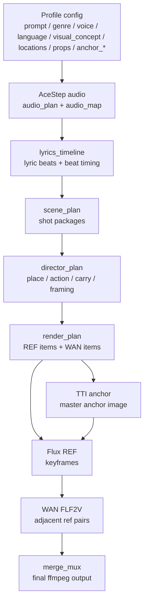

# AI MV Pipeline Overview

이 문서는 현재 파이프라인을 한눈에 보기 위한 운영 문서다.

- 무엇이 어디서 생성되는지
- 어떤 값이 LLM에 들어가는지
- 프로필에 무엇을 넣는 게 맞는지
- 어느 파일을 수정해야 어떤 결과가 바뀌는지

를 빠르게 파악하는 용도다.

## 1. 전체 흐름



## 2. 단계별 실제 파일

### Audio

- Stage: [acestep_music.py](/D:/workspace/ai-music-video/src/ai_mv/core/stages/acestep_music.py)
- Planner: [planner.py](/D:/workspace/ai-music-video/src/ai_mv/engines/acestep_1_5_aio/planner.py)
- Prompt helpers: [prompting.py](/D:/workspace/ai-music-video/src/ai_mv/engines/acestep_1_5_aio/prompting.py), [lyric_blocks.py](/D:/workspace/ai-music-video/src/ai_mv/engines/acestep_1_5_aio/lyric_blocks.py)
- Runner/policy: [runner.py](/D:/workspace/ai-music-video/src/ai_mv/engines/acestep_1_5_aio/runner.py), [policy.py](/D:/workspace/ai-music-video/src/ai_mv/engines/acestep_1_5_aio/policy.py)

출력:

- `audio_plan`
  - tags
  - bpm
  - keyscale
  - duration
  - lyrics_blocks
- `audio_map`
  - section windows
  - music file
  - bpm_estimate

LLM 역할:

- songform outline
- full lyric draft
- invalid rewrite
- image/hook refresh
- unified critique polish

핵심 입력:

- `prompt`
- `genre`
- `voice`
- `language`

## 3. Storyboard chain

### 3.1 lyrics_timeline

- Stage: [lyrics_timeline.py](/D:/workspace/ai-music-video/src/ai_mv/core/stages/lyrics_timeline.py)
- Planner: [planner.py](/D:/workspace/ai-music-video/src/ai_mv/engines/lyrics_timeline/planner.py)

입력:

- `audio_plan`
- `audio_map.sections`
- minimal profile intent from [director_brief.py](/D:/workspace/ai-music-video/src/ai_mv/core/director_brief.py)

LLM에 보내는 핵심:

- 섹션별 실제 lyric lines
- visual concept
- preferred locations
- carry-friendly props
- 곡 언어

출력:

- `lyrics_timeline.sections[*].lyric_beats[*]`
  - `line_refs`
  - `literal_image`
  - `visible_action`
  - `emotional_turn`
  - `continuity_anchor`
  - `payoff_role`
  - `start_sec`
  - `end_sec`

현재 의미:

- 실제 DSP beat extraction은 아님
- BPM grid 기반 lyric beat timing

수정 포인트:

- lyric beat 타이밍/밀도: [planner.py](/D:/workspace/ai-music-video/src/ai_mv/engines/lyrics_timeline/planner.py)
- line grouping/scene semantics: 같은 파일

### 3.2 scene_plan

- Stage: [scene_plan.py](/D:/workspace/ai-music-video/src/ai_mv/core/stages/scene_plan.py)
- Planner: [planner.py](/D:/workspace/ai-music-video/src/ai_mv/engines/scene_plan/planner.py)

역할:

- lyric beat를 shot package로 나눈다

출력:

- `scene_outline.shot_packages[*]`
  - `shot_id`
  - `section_name`
  - `section_label`
  - `line_refs`
  - `literal_image`
  - `visible_action`
  - `emotional_turn`
  - `continuity_anchor`
  - `payoff_role`
  - `duration_sec`
  - `segment_focus`

현재 핵심:

- beat 길이와 내용 밀도에 따라 1 beat를 여러 shot으로 나눔

수정 포인트:

- shot 수가 너무 많다: [planner.py](/D:/workspace/ai-music-video/src/ai_mv/engines/scene_plan/planner.py)
- 어떤 beat를 몇 개로 나눌지: 같은 파일의 segmentation 로직

### 3.3 director_plan

- Stage: [director_plan.py](/D:/workspace/ai-music-video/src/ai_mv/core/stages/director_plan.py)
- Planner: [planner.py](/D:/workspace/ai-music-video/src/ai_mv/engines/director_plan/planner.py)

역할:

- shot package를 실제 visual shot card로 번역

출력:

- `direction_plan.shot_packages[*]`
  - `place`
  - `action`
  - `carry`
  - `framing`
  - `shot_function`
  - 위 scene fields 일부 carry-over

핵심:

- 여기서 장소 추론 heuristic가 들어감
- 여기서 action/carry/framing이 결정됨

수정 포인트:

- 장소가 자꾸 diner/street로 흔들림: [planner.py](/D:/workspace/ai-music-video/src/ai_mv/engines/director_plan/planner.py)
- 같은 beat 안 shot 분화가 약함: 같은 파일

### 3.4 render_plan

- Stage: [render_plan.py](/D:/workspace/ai-music-video/src/ai_mv/core/stages/render_plan.py)
- Planner: [planner.py](/D:/workspace/ai-music-video/src/ai_mv/engines/render_plan/planner.py)
- Minimal renderer: [render_verbalizer.py](/D:/workspace/ai-music-video/src/ai_mv/core/stages/render_verbalizer.py)

역할:

- `direction_plan`을 `prompt_plan`으로 변환

출력:

- `prompt_plan.master_anchor`
- `prompt_plan.ref_items[*]`
  - `ref_prompt_text`
- `prompt_plan.wan_items[*]`
  - `wan_positive_prompt_text`

현재 REF 구조:

1. shot card
2. full draft
3. polish

현재 WAN 구조:

1. adjacent pair bridge card
2. full draft
3. polish

수정 포인트:

- REF subject drift / weird wording: [planner.py](/D:/workspace/ai-music-video/src/ai_mv/engines/render_plan/planner.py)
- minimal text shape: [render_verbalizer.py](/D:/workspace/ai-music-video/src/ai_mv/core/stages/render_verbalizer.py)

## 4. Image/video generation chain

### 4.1 TTI anchor

- Stage: [tti_anchor.py](/D:/workspace/ai-music-video/src/ai_mv/core/stages/tti_anchor.py)
- Runner: [runner.py](/D:/workspace/ai-music-video/src/ai_mv/engines/flux_2_dev_tti/runner.py)
- Workflow: [image_flux2_text_to_image.json](/D:/workspace/ai-music-video/workflows/image_flux2_text_to_image.json), [image_flux2.json](/D:/workspace/ai-music-video/workflows/image_flux2.json)

역할:

- REF에서 공통으로 쓸 master anchor 이미지 생성

입력:

- `anchor_subject`
- `anchor_hair`
- `anchor_top`
- `anchor_bottom`
- `anchor_shoes`
- `anchor_pose`
- `anchor_background`

중요:

- 여기엔 `vocalist` 같은 역할 설명보다 캐릭터 설명이 더 맞음
- 한국인/국적/스타일도 기본 계약이 아니라 프로필에 넣는 게 맞음

### 4.2 Flux REF

- Stage: [flux2_ref_chain.py](/D:/workspace/ai-music-video/src/ai_mv/core/stages/flux2_ref_chain.py)
- Runner: [runner.py](/D:/workspace/ai-music-video/src/ai_mv/engines/flux_2_dev_ref/runner.py)
- Mapper: [mapper.py](/D:/workspace/ai-music-video/src/ai_mv/engines/flux_2_dev_ref/mapper.py)

역할:

- `prompt_plan.ref_items`와 TTI master anchor로 keyframe 생성

현재 특성:

- 이전 REF 이미지를 chaining하지 않음
- master anchor + shot text 기반

그래서 생길 수 있는 문제:

- face continuity는 강함
- 공간/소품 continuity는 텍스트 의존

### 4.3 WAN FLF2V

- Stage: [wan_interpolation.py](/D:/workspace/ai-music-video/src/ai_mv/core/stages/wan_interpolation.py)
- Runner: [runner.py](/D:/workspace/ai-music-video/src/ai_mv/engines/wan_2_2_flf2v/runner.py)
- Mapper: [mapper.py](/D:/workspace/ai-music-video/src/ai_mv/engines/wan_2_2_flf2v/mapper.py)
- Workflow: [video_wan2_2_14B_flf2v.json](/D:/workspace/ai-music-video/workflows/video_wan2_2_14B_flf2v.json)

역할:

- `ref[i] -> ref[i+1]` 인접 keyframe 쌍을 비디오 clip으로 변환

중요:

- workflow-native fps는 16에 가까움
- clip 길이는 fps와 duration으로 계산하는 게 맞음
- hard `max_frames` cap은 부자연스러움을 만들기 쉬움

현재 수정 방향:

- `wan_max_frames` 고정 제거
- `render.wan_fps` 기준으로 길이 계산

### 4.4 Merge

- Stage: [merge_mux.py](/D:/workspace/ai-music-video/src/ai_mv/core/stages/merge_mux.py)
- Media plan: [media_resolver.py](/D:/workspace/ai-music-video/src/ai_mv/core/stages/media_resolver.py)

현재 역할:

- head still hold
- first ref hold
- WAN chain
- tail still hold
- ffmpeg mux

최종 산출:

- run state folder의 `final_mv.mp4`

## 5. 프로필에 넣는 게 맞는 것 / LLM에 계약으로 두는 게 맞는 것

### 프로필에 넣는 게 맞는 것

- 곡 내용
  - `prompt`
- 음악 방향
  - `genre`
  - `voice`
  - `language`
- 비주얼 세계
  - `visual_concept`
  - `locations`
  - `props`
- 캐릭터 앵커
  - `anchor_subject`
  - `anchor_hair`
  - `anchor_top`
  - `anchor_bottom`
  - `anchor_shoes`
  - `anchor_pose`
  - `anchor_background`

예:

```yaml
prompt: "비 오는 도시의 밤을 걸으며 끝난 관계를 곱씹는 노래"
genre: "synth pop"
voice: "solo female, airy and emotional"
language: "ko"

visual_concept: "grounded cinematic late-night music video"
locations:
  - "dim late-night diner"
  - "wet city street at night"
  - "concrete rooftop at dawn"
props:
  - "worn notebook"
  - "half-empty coffee mug"
  - "studio headphones"

anchor_subject: "young adult Korean woman"
anchor_hair: "long dark hair with soft volume and light face-framing strands"
anchor_top: "clean fitted knit top with a short polished outer layer"
anchor_bottom: "short skirt or slim premium denim bottom"
anchor_shoes: "premium everyday sneakers or slim ankle boots"
anchor_pose: "full-body standing pose, slight side angle, both hands visible, shoes fully visible"
anchor_background: "plain neutral studio background, no props, no environmental elements"
```

### 계약으로 두는 게 맞는 것

- 형식 안정성
  - JSON schema
  - required fields
  - label ordering
  - Keep the face.
- 의미 보존
  - 새 장소/새 소품 발명 금지
  - subject wording 유지
  - continuity 유지
- 분화 규칙
  - same beat 안 shot 차이
  - REF/WAN 중복 억제

### 계약에 넣으면 범용성을 해치는 것

- `language: ko -> Korean person` 자동 강제
- 특정 국가/인종/직업/시대상 기본 주입
- 특정 장르에서만 통하는 미학 강제
- 코드에서 예쁜 문장 형태를 직접 하드코딩하는 것

## 6. 수정하려는 목적별로 어디를 봐야 하는지

### 가사 품질을 바꾸고 싶다

- [planner.py](/D:/workspace/ai-music-video/src/ai_mv/engines/acestep_1_5_aio/planner.py)
- [lyric_blocks.py](/D:/workspace/ai-music-video/src/ai_mv/engines/acestep_1_5_aio/lyric_blocks.py)
- [prompting.py](/D:/workspace/ai-music-video/src/ai_mv/engines/acestep_1_5_aio/prompting.py)

### lyric beat 타이밍/분할이 이상하다

- [planner.py](/D:/workspace/ai-music-video/src/ai_mv/engines/lyrics_timeline/planner.py)

### REF가 너무 많거나 비슷한 샷이 많다

- [planner.py](/D:/workspace/ai-music-video/src/ai_mv/engines/scene_plan/planner.py)
- [planner.py](/D:/workspace/ai-music-video/src/ai_mv/engines/director_plan/planner.py)

### REF prompt가 어색하거나 drift한다

- [planner.py](/D:/workspace/ai-music-video/src/ai_mv/engines/render_plan/planner.py)
- [render_verbalizer.py](/D:/workspace/ai-music-video/src/ai_mv/core/stages/render_verbalizer.py)

### TTI 캐릭터가 약하다

- 프로필 `anchor_*` 먼저
- 그 다음 [tti_anchor.py](/D:/workspace/ai-music-video/src/ai_mv/core/stages/tti_anchor.py)

### WAN이 회색으로 끝나거나 길이가 안 맞는다

- [wan_interpolation.py](/D:/workspace/ai-music-video/src/ai_mv/core/stages/wan_interpolation.py)
- [config_defaults.py](/D:/workspace/ai-music-video/src/ai_mv/core/orchestration/config_defaults.py)
- [media_resolver.py](/D:/workspace/ai-music-video/src/ai_mv/core/stages/media_resolver.py)
- [merge_mux.py](/D:/workspace/ai-music-video/src/ai_mv/core/stages/merge_mux.py)

## 7. 현재 추천 수정 방향

### 이미 충분히 얇은 부분

- TTI
- AceStep 단계 구조
- REF/WAN naturalization 구조

### 전면 교체 가치가 큰 부분

1. `lyrics_timeline`의 synthetic beat timing
2. `scene_plan`의 segmentation 기준
3. `REF chaining` 전략
4. `WAN duration` 계산
5. `merge coverage`

## 8. 빠른 판단 기준

- 캐릭터 문제면: 프로필 `anchor_*`
- 가사 문제면: AceStep
- 샷 수/타이밍 문제면: lyrics_timeline + scene_plan
- 프롬프트 문장 문제면: render_plan
- 실제 비디오 길이/회색 tail 문제면: wan_interpolation + merge_mux

